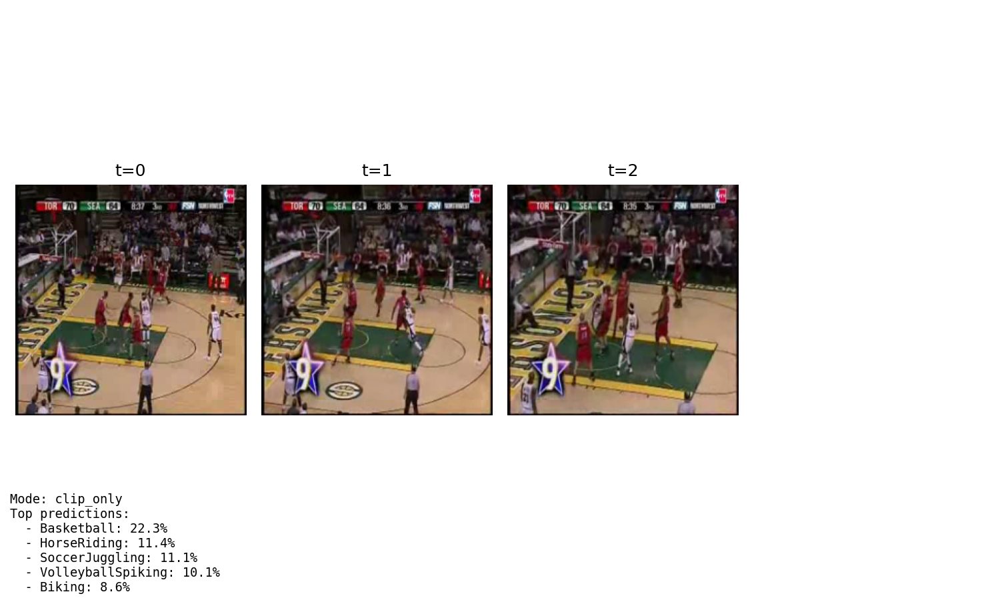
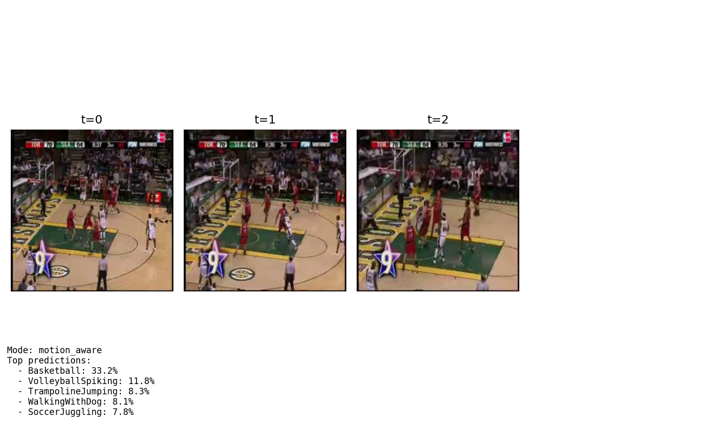
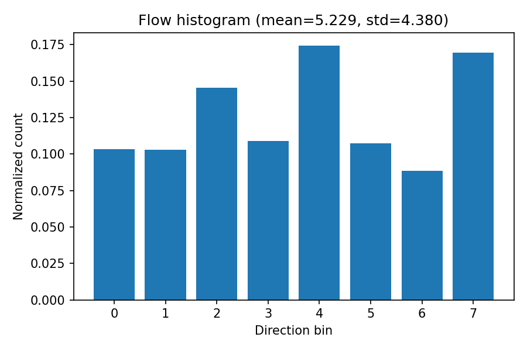

# MotionSense VLM

A Vision-Language Model (VLM) that combines CLIP-based semantic understanding with motion-aware features for video action recognition.

## Overview

MotionSense VLM enhances video action recognition by fusing:
- **Semantic features**: CLIP-based embeddings from sparse video frames
- **Motion features**: Optical flow statistics extracted from video sequences

This hybrid approach leverages both semantic understanding and temporal motion patterns for improved action classification.

## Project Structure

```
MotionSense_VLM/
├── config/          # Configuration files
├── data/           # Data loading and processing
├── models/         # Model architectures
├── eval/           # Evaluation and benchmarking
├── demos/          # Visualization and demos
├── scripts/        # Main execution scripts
└── outputs/        # Generated outputs
```

## Installation

### Prerequisites

- Python 3.8+
- CUDA-capable GPU (recommended)

### Setup

1. Clone the repository:
```bash
git clone <repository-url>
cd MotionSense_VLM
```

2. Create a virtual environment:
```bash
python -m venv venv
source venv/bin/activate  # On Windows: venv\Scripts\activate
```

3. Install dependencies:
```bash
pip install -r requirements.txt
```

## Requirements

See `requirements.txt` for the complete list of dependencies.

Key dependencies:
- PyTorch >= 2.0.0
- torchvision >= 0.15.0
- open-clip-torch (for CLIP models)
- opencv-python >= 4.8.0
- numpy >= 1.24.0

## Data

**Dataset**: [UCF101 Action Recognition](https://www.crcv.ucf.edu/data/UCF101.php)

- Download UCF101 (e.g. from the official site or a mirrored source such as Kaggle).
- Extract it so that the **train** and **val** splits are available on disk.

The code expects the following layout (see `config/default.yaml` and `config/val.yaml`):

```text
MotionSense_VLM/
  UCF101/
    train/
      Basketball/
        *.avi
      Biking/
        *.avi
      ...
    val/
      Basketball/
        *.avi
      Biking/
        *.avi
      ...
```

- Each **action class** is a subfolder (`Basketball`, `Biking`, ..., `WalkingWithDog`) containing the `.avi` videos.
- We use a **10-class subset** controlled via the config (`data.classes`) and limit the number of clips per class with `max_clips_per_class`.
- No separate `prepare_data.py` script is needed as long as this directory structure is followed.

## Usage

From the project root. Data is expected under `UCF101/train` and `UCF101/val` (see `config/default.yaml` and `config/val.yaml`).

**Train CLIP-only baseline:**
```bash
python scripts/train.py
# Saves: outputs/checkpoints/clip_only_head.pt
```

**Train motion-aware model (CLIP + optical flow fusion):**
```bash
python scripts/train_motion_aware.py --config config/default.yaml
# Saves: outputs/checkpoints/motion_aware.pt
```

**Compare both models on the validation set:**
```bash
python scripts/run_comparison.py --val-config config/val.yaml
```

**Evaluate a single checkpoint:**
```bash
python scripts/run_eval.py --config config/val.yaml --checkpoint outputs/checkpoints/clip_only_head.pt
```

**Run a single-video demo (visualization):**
```bash
# CLIP-only demo
python scripts/run_demo.py --mode clip_only --video UCF101/val/Basketball/your_video.avi

# Motion-aware demo (requires motion_aware.pt)
python scripts/run_demo.py --mode motion_aware --video UCF101/val/Basketball/your_video.avi
```

## Results

Evaluation on the UCF101 subset (10 classes) with `config/val.yaml`. Motion-aware (CLIP + optical flow statistics) outperforms the CLIP-only baseline on held-out validation data.

| Model         | Val accuracy |
|---------------|--------------|
| CLIP-only     | **76.51%**   |
| Motion-aware  | **86.58%**   |

Adding explicit motion (Farneback optical flow: magnitude + direction bins) and late fusion improves validation accuracy by ~10 percentage points, consistent with the idea that motion is critical for action recognition beyond static appearance.

## Demo

Example on a UCF101 validation clip (`BasketballDunk`). Input video and model outputs:

- **Sample video:** [v_BasketballDunk_g01_c02.mp4](outputs/demo/v_BasketballDunk_g01_c02.mp4) (GitHub does not render `<video>` in READMEs; open the link or view locally to play.)

**CLIP-only prediction**



**Motion-aware prediction (frames)**



**Motion-aware flow histogram**



## Development Status

**Current Phase**: Training, evaluation & benchmarking ✅

- [x] Project structure and config (YAML)
- [x] Data loading (video frames, optional flow stats)
- [x] CLIP encoder + linear head (CLIP-only)
- [x] Motion-aware fusion (CLIP + flow stats → MLP)
- [x] Training scripts (`train.py`, `train_motion_aware.py`)
- [x] Evaluation and comparison (`run_eval.py`, `run_comparison.py`)
- [x] Visual demo (flow + prediction; `run_demo.py`, `demos/visualize.py`)

## License

*To be determined*

## Contributing

*Guidelines coming soon*
